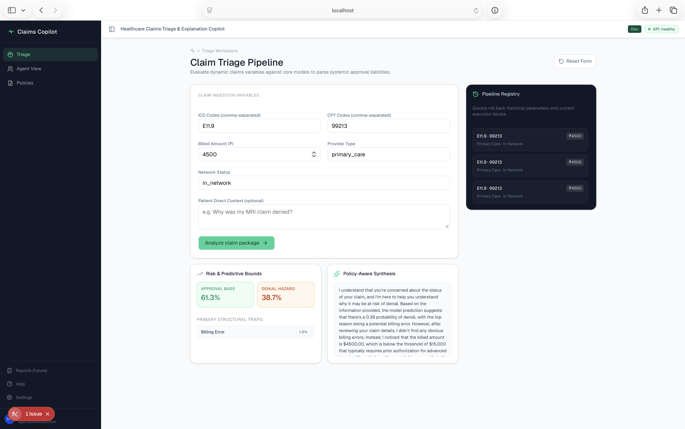
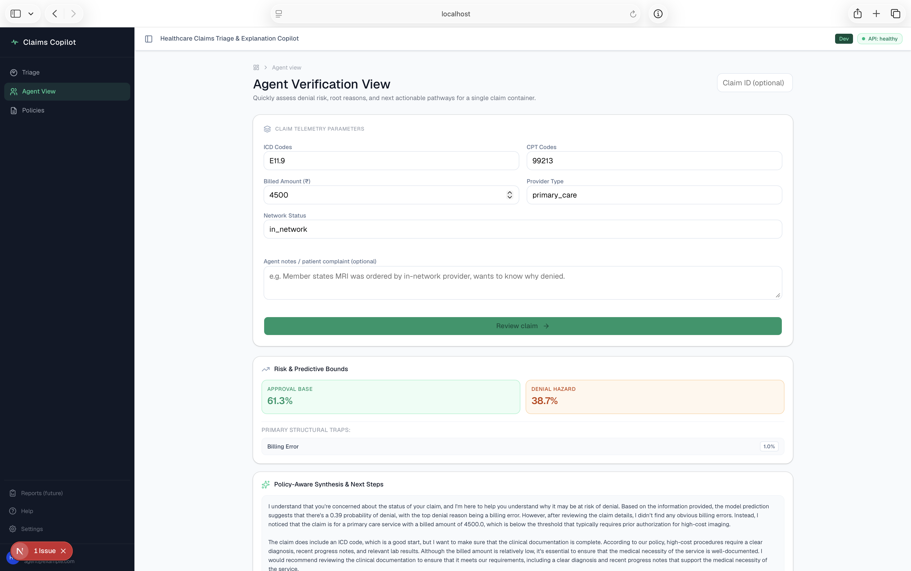
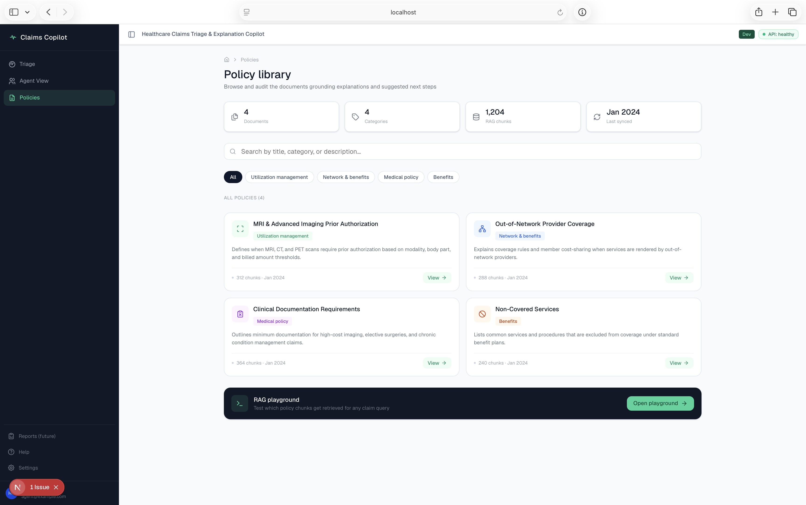
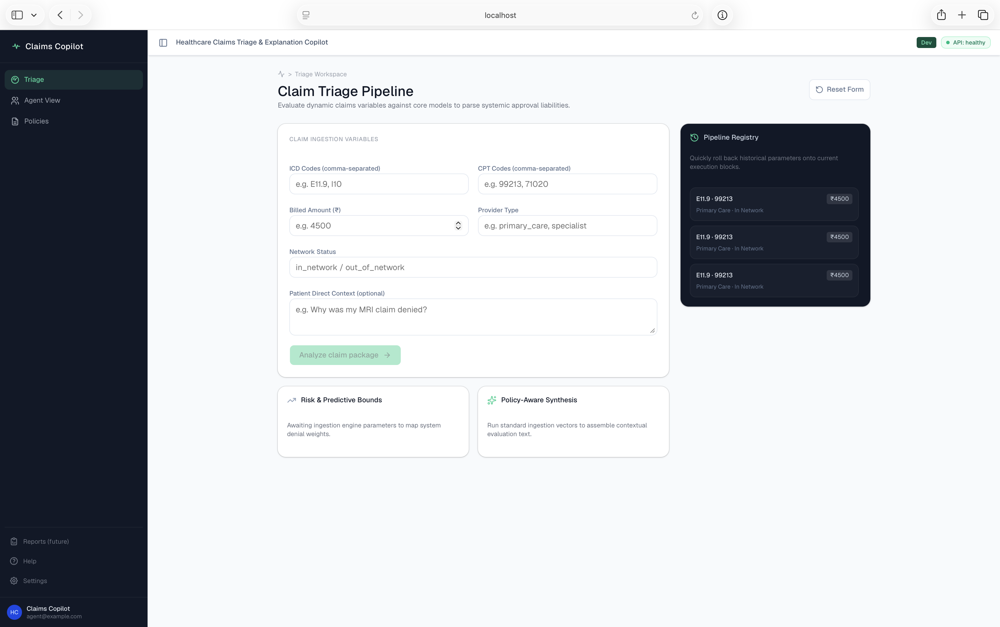

# Healthcare Claims Triage & Explanation Copilot

An end-to-end **ML + GenAI-style** project that predicts healthcare claim denials,
explains them in natural language, and surfaces likely next steps for agents and patients.

Built with:

- Backend: FastAPI, scikit-learn (RandomForest), Python
- Frontend: Next.js (App Router), TypeScript, shadcn/ui
- Data & ML: Synthetic claims dataset, binary + multi-label models
- Infra: Docker-ready, CORS, clear API contracts

## Features

- **Claim Triage (Triage page `/`):**
  - Form to enter ICD/CPT, billed amount, provider type, network status, notes.
  - Predicts approval vs denial probability.
  - Shows top likely denial reasons with calibrated probabilities.
  - Backend-generated natural language explanation via `/explain_claim`.

- **Agent View (`/agent`):**
  - Focused view for a single claim: quick fields + agent notes.
  - Risk assessment panel (approval/denial probabilities, reasons).
  - Explanation & next-steps panel using the same backend APIs.

- **Policies (`/policies`):**
  - Catalog of policy documents that will ground RAG explanations.
  - Searchable by title, category, and description.

- **Health & Observability:**
  - `/health` endpoint on the API.
  - Frontend header shows live backend status (API healthy/down).

## Architecture

### Backend (FastAPI)

- `app/main.py`:
  - `/health` – health check.
  - `/predict_claim` – serves trained ML models for:
    - binary approval vs denial.
    - multi-label denial reasons.
  - `/explain_claim` – builds a natural-language explanation on top of predictions.

- ML artifacts:
  - `data/claims_synthetic.csv` – synthetic training data.
  - `scripts/generate_synthetic_claims.py` – data generator.
  - `scripts/train_models.py` – trains RandomForest-based models and saves:
    - `models/approval_model.joblib`
    - `models/denial_reasons_model.joblib`

### Frontend (Next.js + shadcn)

- `app/page.tsx` – Triage page.
- `app/agent/page.tsx` – Agent View.
- `app/policies/page.tsx` – Policies catalog.
- `components/BackendStatus.tsx` – shows backend health in header.
- `components/ui/*` – shadcn/ui components.

## Running locally

### Backend

```bash
cd fastapi-backend
python -m venv .venv
source .venv/bin/activate

pip install -r requirements.txt  # or install minimal deps: fastapi, uvicorn, scikit-learn, joblib, pandas, numpy

# (optional, first time) generate data and train models
python scripts/generate_synthetic_claims.py
python scripts/train_models.py

# run API
uvicorn app.main:app --reload --host 0.0.0.0 --port 8000
```

### Frontend

```bash
cd nextjs-frontend
npm install
npm run dev
```

Open `http://localhost:3000` in your browser.

## Docker (optional)

### Backend

```bash
cd fastapi-backend
docker build -t claims-backend .
docker run --rm -p 8000:8000 claims-backend
```

### Frontend

```bash
cd nextjs-frontend
docker build -t claims-frontend .
docker run --rm -p 3000:3000 claims-frontend
```

## Screenshots

Below are sample screenshots of the Healthcare Claims Triage & Explanation Copilot UI.

### Triage Dashboard



- Main Triage page built with Next.js, TypeScript, and shadcn/ui.
- Claim input form for ICD/CPT codes, billed amount, provider/network details, and patient question.
- Real-time prediction card showing approval vs. denial probability and top denial reasons.
- Explanation card showing Groq-backed, policy-aware natural language explanations.
- Recent claims panel that lets agents quickly re-fill the form from previous submissions.

### Agent View



- Agent-focused view that surfaces claim details, risk assessment, and explanation in one place.
- Designed for faster triage and communication with members/providers.
- Reuses the same REST APIs as the Triage page, with a different UX emphasis.

### Policies View



- Policies & RAG grounding page listing synthetic policy documents used for explanations.
- Simple search/filter over policy titles, categories, and descriptions.
- Serves as an explainability layer so the copilot isn’t a pure black box.

### Layout & Navigation



- Global layout using shadcn’s sidebar primitives.
- Collapsible sidebar with navigation to Triage, Agent View, and Policies.
- Top header with sidebar trigger, environment label, and live backend health status.

## Roadmap 

- Plug in real RAG over policy documents for `/explain_claim`.
- Add simple Dockerfiles for backend and frontend.
- Add basic monitoring/logging and CI pipeline.